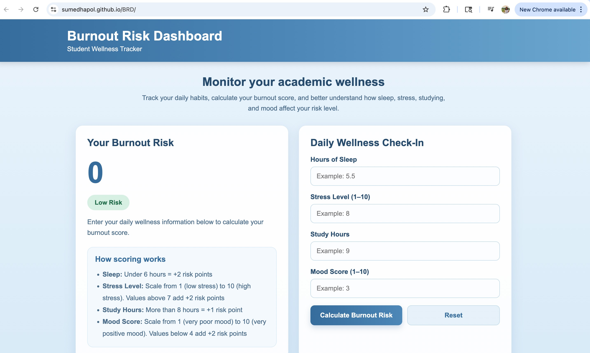
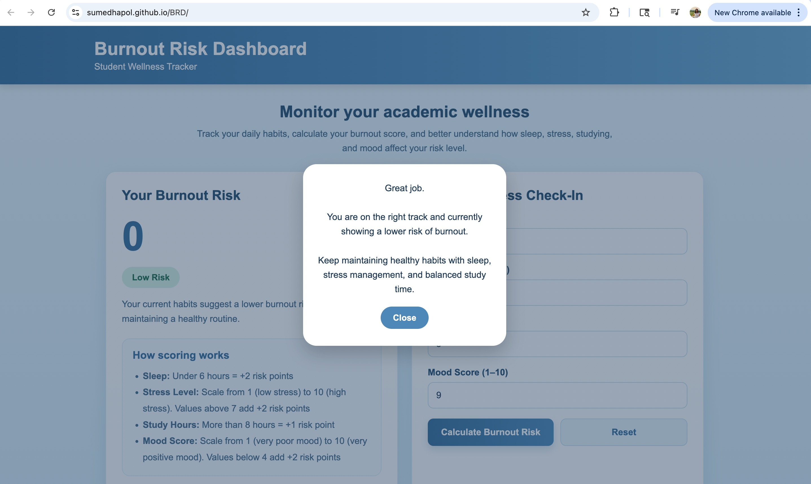
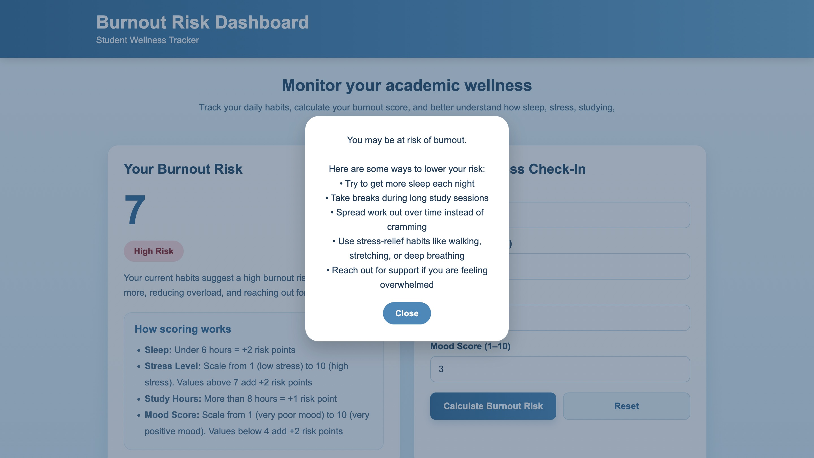

# BRD - Burnout Risk Dashboard - Student Wellness Tracker

## Description
Burnout Risk Dashboard is a full-stack web application designed to help students track early signs of academic burnout using simple daily inputs.

Students enter key metrics such as: 
- Sleep Hours
- Stress level (1-10)
- Study Hours
- Mood Score (1-10)

The application calculates a Burnout Indecn and displays trends to help users recognize patterns and take action before burnout becomes severe.

------

## Purpose
Many students experience burnout but don't realize it until it negatively affects their performance and mental health.

This app focuses specifically on academic burnout, unlike genreal wellness apps, by:
- Providing a clear burnour score
- Tracking academic-related habits
- Visualizing trens over time

This project demonstrates full-stack development using a Node.js backend, MongoDB database, and a responsive front-end interface.

------

## Core MVP Features
- User authentication (Register & Login)
- Secure password storage using hashing
- Daily wellness input form
- Burnout risk score calculation
- Dynamic risk level feedback (Low / Moderate / High)
- Data persistence using MongoDB
- History tracking of past entries
- Weekly burnout trend graph (Chart.js)
- Responsive UI design for different screen sizes
- Logout functionality

------

## Burnout Index Logic (MVP)
The Burnout Score is calculated using a simple point system:

- Sleep < 6 hours → +2 points  
- Stress > 7 → +2 points  
- Study hours > 8 → +1 point  
- Mood < 4 → +2 points  

**Risk Levels:**
- 0–2 → Low  
- 3–5 → Moderate  
- 6+ → High  

---

## Tech Stack 
Frontend
- HTML
- CSS
- JavaScript

Backend
- Node.js
- Express.js

Database
- MongoDB Atlas

Other Tools
- Chart.js (for graph visualization)
- JWT (authentication)
- bcrypt (password hashing)

---

## Installation & Setup
This project is a front-end based web application and does not require any special installation.
Follow these steps to run the Burnout Risk Dashboard locally:
1. Clone or Download the Repository
   git clone https://github.com/your-username/your-repo-name.git
   cd your-repo-name
Or download the ZIP from GitHub and open the folder in VS Code.

2. Install Dependencies
In the project terminal, run:
   npm install

3. Set Up MongoDB Atlas
Go to https://www.mongodb.com/atlas
Create a free account
Create a cluster (Free tier)
Create a database user (username + password)
Allow access from anywhere (Network Access)
Click Connect → Drivers and copy your connection string

4. Rewrite the .env file (make sure to add your password to the string)
   MONGO_URI=your_mongodb_connection_string
   JWT_SECRET=your_secret_key
   PORT=3000

5. Run the Application
Start the server:
   node server.js

6. Open in Browser
   http://localhost:3000
---

## Screenshots
### Login Page

### Welcome Page

### Initial Dashboard

### Low Risk Result

### High Risk Result

---

## Demo video
https://github.com/user-attachments/assets/6516637e-b4c5-4c67-a7a2-ddd2922476e4

---

## Future Development
- Mobile-friendly UI improvements
- Push notifications for high burnout risk
- AI-based burnout prediction
- Personalized recommendations
- Integration with campus wellness services
- Multi-day analytics dashboard

---

## Contributors 
- Samiya Naseer (smn5914@psu.edu)
- Sumedha Pol (smp6989@psu.edu)

---

